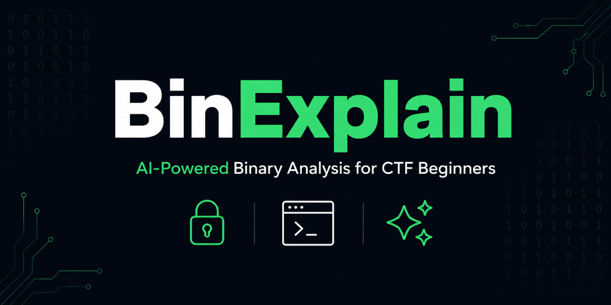

<div align="center">



# 🔍 BinExplain
 
### Free AI-Powered Binary Analysis for CTF Beginners
 
[](https://binexplain.com)
[](LICENSE)
[](backend/tests)
[](https://github.com/Vaibhavi28/binexplain/stargazers)
[](https://github.com/Vaibhavi28/binexplain/issues)
[](https://github.com/Vaibhavi28/binexplain/commits/master)
 
---
 
### Tech Stack
 
[](https://python.org)
[](https://fastapi.tiangolo.com)
[](https://reactjs.org)
[](https://vitejs.dev)
[](https://sqlite.org)
[](https://cloud.google.com)
 
### AI Providers
 
[](https://groq.com)
[](https://openrouter.ai)
[](https://aistudio.google.com)
[](https://openai.com)
[](https://ollama.ai)
[](https://anthropic.com)
 
### Security & Analysis
 
[](https://capstone-engine.org)
[](https://trychroma.com)
[](https://pwntools.com)
[](https://virustotal.com)
 
---
 
**Upload a binary → Instant CTF category, ROP gadgets, pwntools template, parallel AI hints**
 
**No installation. No account. Always free for individual use.**
 
[🚀 **Try It Now at binexplain.com**](https://binexplain.com) · [🐛 Report Bug](https://github.com/Vaibhavi28/binexplain/issues) · [💡 Request Feature](https://github.com/Vaibhavi28/binexplain/issues)
 
> ⚠️ **License Notice:** Source-available, not open source. You may use the live tool and view the code. Cloning, forking, and redistribution are not permitted. See [LICENSE](LICENSE).
 
</div>
---
 
## 🎯 What Problem Does This Solve?
 
Every CTF beginner downloads their first binary and has no idea what to do next.
 
Professional tools — Ghidra, Binary Ninja, IDA Pro — are designed for experts. They show you data. They don't tell you what it **means** or what to **do next**.
 
**BinExplain does something different. It acts like a senior CTF player sitting next to you.**
 
Upload a binary. Within seconds you know:
- What type of CTF challenge you're looking at
- How hard it is
- What security protections are active
- What ROP gadgets are available
- The predicted buffer overflow offset
- A complete working exploit template
- AI hints specific to YOUR binary, not generic advice
---
 
## 🎬 Demo
 
> Upload `schooled.elf` → See CTF Category: **Heap Exploitation (High confidence)** → Download pre-populated pwntools template → Ask the AI mentor anything
 
<!-- Add your demo GIF here:  -->
 
---
 
## ✨ Features
 
### Binary Analysis
| Feature | Details |
|---------|---------|
| 🎯 **CTF Category Detection** | ret2win, ret2libc, heap exploitation, format string, ROP chain, shellcode — with confidence level |
| 🎲 **Difficulty Predictor** | Easy / Medium / Hard based on active protections |
| 🔒 **Checksec Integration** | NX, PIE, Canary, RELRO, Fortify — color coded |
| 🔗 **ROP Gadget Finder** | Real gadgets with addresses via Capstone disassembly |
| ⚡ **Pwntools Template** | Auto-generated with offset, architecture, gadgets pre-filled |
| 📐 **Overflow Offset Predictor** | Predicted from stack allocation instructions in disassembly |
| 📚 **Libc Version Identifier** | Identifies libc + direct link to libc database |
| ⚠️ **Format String Detector** | Detects printf(buf) pattern |
| 📊 **CVSS 3.1 Scoring** | Industry standard vulnerability scoring |
| 🌊 **Data Flow Analysis** | Traces input → buffer → sink with addresses |
| 📜 **Function List** | All functions from ELF symbol table |
| 📥 **Import/Export Table** | Full dynamic symbol parsing |
| 🔍 **Real Disassembly** | main() function via Capstone |
| 🔐 **Password ZIP Support** | Analyze encrypted CTF archives |
| 🚩 **11 Flag Formats** | picoCTF, HTB, THM, DUCTF, and more |
| 📦 **8+ File Formats** | ELF, EXE, BIN, SO, DLL, ZIP + extensionless |
 
### Source Code Analysis (Full Feature Parity)
| Feature | Details |
|---------|---------|
| 🎯 **CTF Category Detection** | Same 6 archetypes, source-adapted |
| 📐 **Overflow Offset** | From buffer declarations — more precise than binary |
| 🌊 **Data Flow Analysis** | Line-level with actual variable names |
| 💡 **Exploit Template** | Working pwntools script from source analysis |
| 📋 **Quick Commands** | Compilation and testing commands for source |
 
### AI System
| Feature | Details |
|---------|---------|
| 🧠 **Parallel AI Inference** | Groq + Nemotron called simultaneously, responses merged |
| 🌐 **RAG Knowledge Base** | Real CTF writeups from CTFtime, Nightmare, ir0nstone, CTF-Wiki |
| ⚡ **CAG Caching** | Common patterns served instantly without LLM calls |
| 💬 **AI Mentor Chat** | Full context awareness, Shift+Enter multiline, code copy buttons |
| 📷 **Screenshot Analysis** | Upload GDB/terminal screenshots for visual AI guidance |
| 🔧 **Command Explainer** | Explains any command with CTF-specific context |
| 🌐 **Similar Writeups** | RAG finds past challenges matching your binary |
 
---
 
## 🤖 AI Architecture
 
### Parallel Inference (New)
```
Binary uploaded
      ↓
Static analysis (2-3 seconds)
      ↓
┌─────────────────────┐    ┌──────────────────────────────┐
│ Groq llama-3.3-70b  │    │ Nemotron 3 Ultra (550B MoE)  │
│ Fast — 1-3 seconds  │    │ Deep — 8-15 seconds          │
└─────────────────────┘    └──────────────────────────────┘
         ↓                              ↓
   Quick hints shown            Enhanced hints ready
   immediately                        ↓
                          Groq merges both responses
                                      ↓
                          ✅ Enhanced with deep reasoning
```
 
### Sequential Fallback Chain
```
1. Groq (llama-3.3-70b)       — Free, fastest
2. Nemotron 3 Ultra            — Free via OpenRouter, deepest reasoning
3. Gemini 2.5 Flash            — Free, strong capability
4. OpenAI GPT-4o-mini          — Paid fallback
5. Ollama llama3.2             — Local, offline capable
6. Anthropic Claude            — Last resort
```
 
### RAG Pipeline
```
CTFtime.org ──┐
Nightmare ────┤──→ Web Scraper ──→ ChromaDB ──→ Semantic Search ──→ AI Context
ir0nstone ────┤         ↑
CTF-Wiki ─────┘    DuckDuckGo
                   Live Search
                   (per binary)
```
 
---
 
## 🛡️ Security Architecture
 
| Property | Implementation |
|----------|---------------|
| **Zero binary execution** | Static analysis only — never executed, ever |
| **3-layer file validation** | Extension + size + magic bytes |
| **Immediate file deletion** | try/finally — deleted even on crash |
| **No data storage** | Conversation lives only in browser |
| **ZIP bomb protection** | Max 20 files, 10MB per archive |
| **Input sanitization** | Chat capped at 2000 chars, history at 10 messages |
| **CORS restricted** | Configured domain only, never wildcard in production |
| **Generic error messages** | No stack traces or internal paths exposed |
| **228 automated tests** | Unit, integration, CTF scenario, chaos testing |
 
---
 
## 🚀 Quick Start
 
### Option 1: Use the Live Tool (Recommended)
👉 **[binexplain.com](https://binexplain.com)** — No installation. Works in any browser.
 
### Option 2: Run Locally
 
```bash
# Clone
git clone https://github.com/Vaibhavi28/binexplain.git
cd binexplain
 
# Backend
cd backend
python3 -m venv venv
source venv/bin/activate  # Windows: venv\Scripts\activate
pip install -r requirements.txt
cp .env.example .env
# Add your API keys to .env
uvicorn main:app --reload
 
# Frontend (new terminal)
cd ../frontend
npm install
echo "VITE_BACKEND_URL=http://localhost:8000" > .env
npm run dev
```
 
Open `http://localhost:5173`
 
---
 
## 🔑 API Keys (All Free Tiers Available)
 
| Provider | Get Key | Used For | Cost |
|----------|---------|---------|------|
| **Groq** | [console.groq.com](https://console.groq.com) | Primary AI (parallel) | Free |
| **OpenRouter** | [openrouter.ai](https://openrouter.ai) | Nemotron 3 Ultra | Free |
| **Gemini** | [aistudio.google.com](https://aistudio.google.com) | Fallback + Vision | Free |
| OpenAI | [platform.openai.com](https://platform.openai.com) | Fallback | Paid |
| VirusTotal | [virustotal.com](https://virustotal.com) | Optional scan | Free |
| Anthropic | [console.anthropic.com](https://console.anthropic.com) | Last resort | Paid |
 
> Full functionality is available using only free-tier keys (Groq + OpenRouter + Gemini).
 
---
 
## 🔮 Roadmap
 
```
v1  ✅  Web app — live at binexplain.com
v2  🔄  CLI tool (pip install binexplain) + Docker container
v2  🔄  Dynamic analysis in Docker sandbox (strace, ltrace, GDB automation)
v3  📋  MCP server for AI assistant integration
v3  📋  Browser extension for CTFtime/HackTheBox
v4  📋  Automated exploit generation via symbolic execution
```
 
---
 
## 📊 Project Stats
 
```
Backend:   Python 3.11, FastAPI, ~5000+ lines
Frontend:  React 18, Vite, ~2000+ lines  
Tests:     228 passing (unit + integration + CTF scenarios + chaos)
Knowledge: 37+ real CTF writeups indexed in ChromaDB
AI:        6 providers, parallel inference, RAG + CAG
```
 
---
 
## 🤝 Contributing
 
This project is source-available under CC BY-NC-ND 4.0 with an academic research restriction currently in place. See [CONTRIBUTING.md](CONTRIBUTING.md) for how to report bugs and suggest features.
 
---
 
## 📄 License
 
**CC BY-NC-ND 4.0** — You may use the live tool and view the code. Redistribution, forking, and commercial use are not permitted without written permission. See [LICENSE](LICENSE).
 
This restriction is in place to protect ongoing academic research. See [SECURITY.md](SECURITY.md) for responsible disclosure.
 
---
 
## 📖 Research
 
This project is the subject of ongoing research being prepared for submission 
 
> *BinExplain: An AI-Powered, Browser-Based Binary Analysis Platform for Lowering the Barrier to Entry in Capture The Flag Binary Exploitation Challenges*
 
Research question: *Does AI-assisted, browser-based scaffolding improve novice success and persistence in introductory binary exploitation tasks?*
 
---
 
## ⚠️ Disclaimer
 
BinExplain performs **static analysis only**. Uploaded files are deleted immediately after analysis. No binaries are ever executed. Only analyze files you own or have explicit permission to analyze.
 
---
 
<div align="center">
**© 2026 Vaibhavi Sanjay Kathepuri. All rights reserved beyond the terms of the CC BY-NC-ND 4.0 license.**
 
Built with ❤️ for the CTF community
 
⭐ **If BinExplain helped you solve a CTF challenge, please star this repo!** ⭐
 
[binexplain.com](https://binexplain.com) · [GitHub](https://github.com/Vaibhavi28/binexplain) · [Report a Bug](https://github.com/Vaibhavi28/binexplain/issues)
 
</div>
